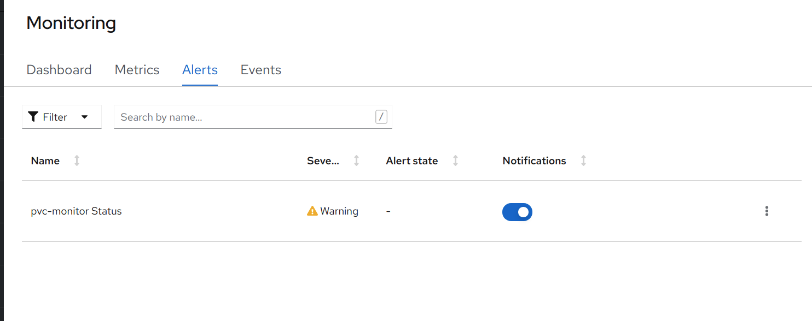
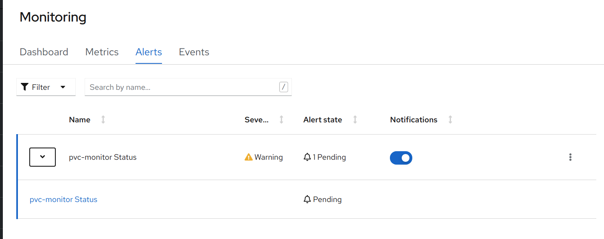
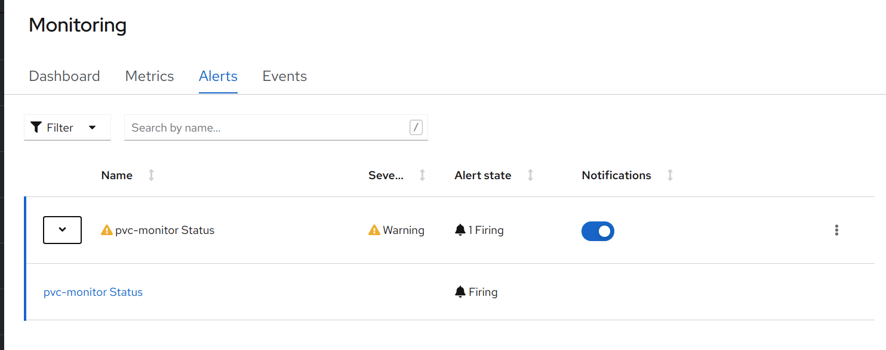

# PVC Creation Tester

The following code fully demonstrates how to use the user monitoring features in OCP 4 to alert if the system is unable to fulfill a PVC request.  


## How Does it Work

This very simple Python application works along with a Prometheus [ServiceMonitor](https://docs.openshift.com/container-platform/latest/monitoring/managing-metrics.html#specifying-how-a-service-is-monitored_managing-metrics) and [PrometheusRule](https://docs.openshift.com/container-platform/latest/monitoring/managing-alerts.html#creating-alerting-rules-for-user-defined-projects_managing-alerts) to allow the Prometheus instance to scrape the application.

When the Prometheus scrape occurs, the Python application creates and PVC and wait for it to be bound.  If the bound occurs within 90 seconds, the application returns a metric with a value of `1`.  If the bind fails, then the metric value is set to `0`.  The `PrometheusRule` is set to fire if the metric is `0` for more than `5m`.  

## Extensibility
The Python and Helm are currently written with the factory pattern in mind.  Therefore, it will be simple to add additional monitors is necessary.  

## Requirements
This code requires that User Monitor is [enabled](https://docs.openshift.com/container-platform/latest/monitoring/enabling-monitoring-for-user-defined-projects.html) on the OpenShift cluster and the user has the [necessary permissions](https://docs.openshift.com/container-platform/latest/monitoring/enabling-monitoring-for-user-defined-projects.html#granting-users-permission-to-configure-monitoring-for-user-defined-projects_enabling-monitoring-for-user-defined-projects).  [Configuring](https://docs.openshift.com/container-platform/4.7/monitoring/configuring-the-monitoring-stack.html#configuring-the-monitoring-stack_configuring-the-monitoring-stack) persistent storage for the User Monitor stack is highly recommended.  

## Build and Deployment Steps

To build and deploy the application a Helm chart is provided.  The Helm charts create a BuildConfig that's used to create the application image.  


### Install
```
#Create the namespace
oc create namespace pvc-tester

#To deploy the build and deployment components
helm upgrade --install monitors charts/monitor/ --namespace pvc-tester
```

### Uninstall
```
helm uninstall monitors  --namespace pvc-tester
```

## Alert Samples

### PVC Alert in OpenShift


### Pending PVC Alert in OpenShift


### Firing PVC Alert in OpenShift

